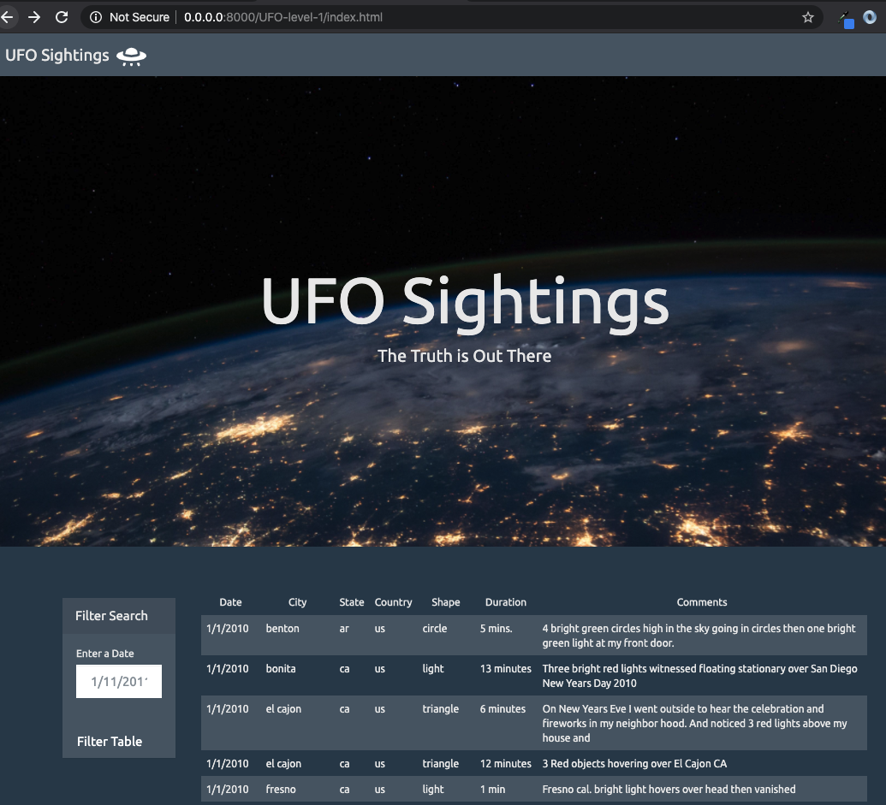
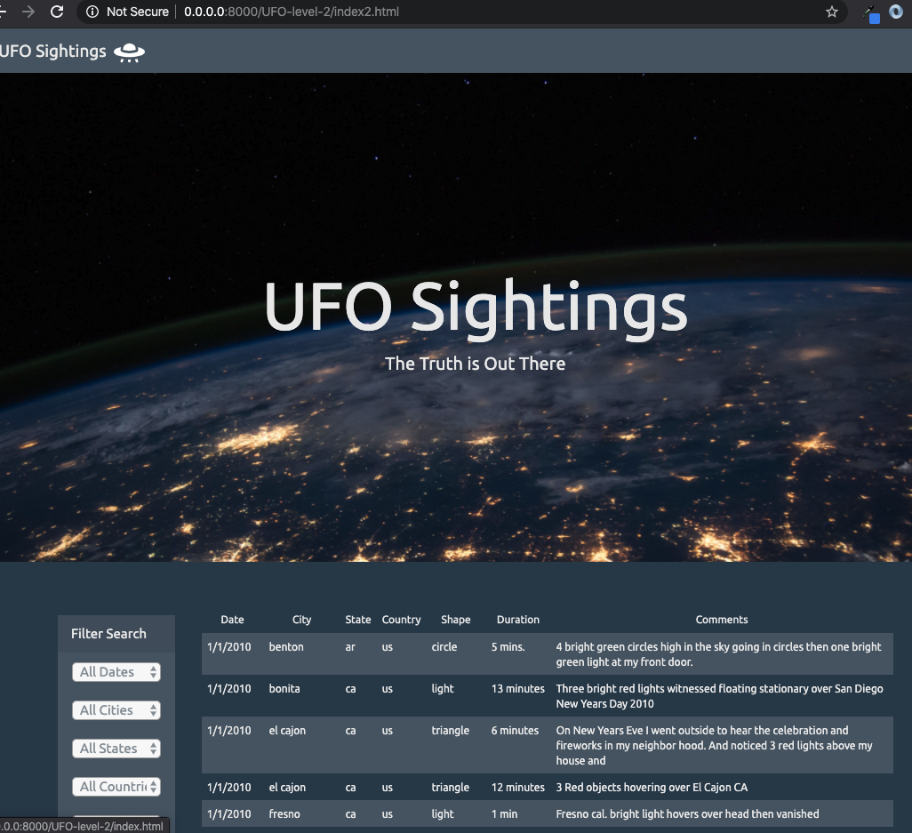

# UFO Sightings 

## Summary

A web application that uses Javascript, D3 and Javascript libraries (bootstrap and googleapis) to create a data-driven interactive web page, hosted on local server via "python -m http.server".  A dynamic table is loaded with data from a file and then form input is used to filter the data displayed.

### UFO Level 1
Load data from file into table on the web page.  Then allow user to filter the data by the Date field

### UFO Level 2
Load data from file into table on the web page.  Then allow user to filter the data by multiple fields (date, city, state, country, shape)

